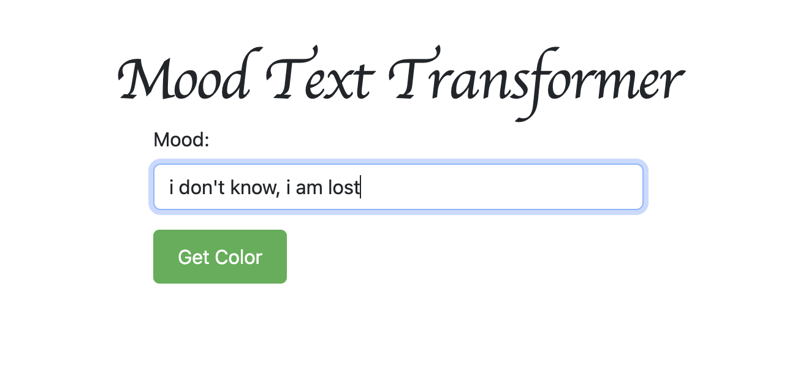
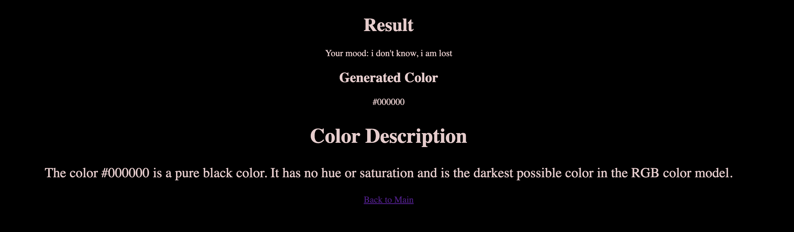
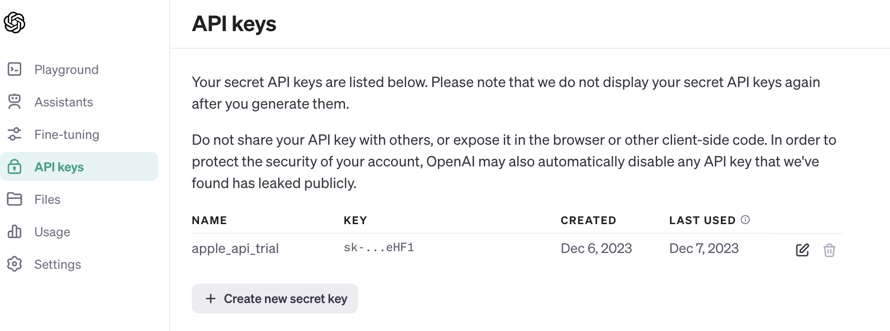
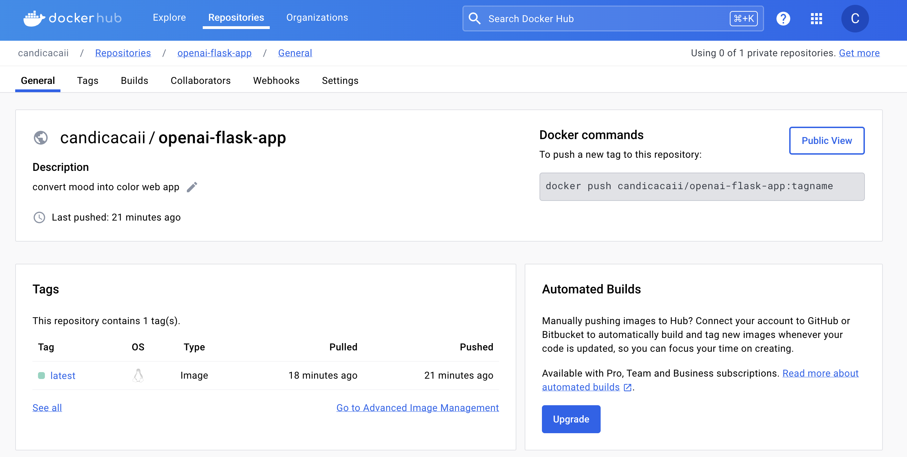
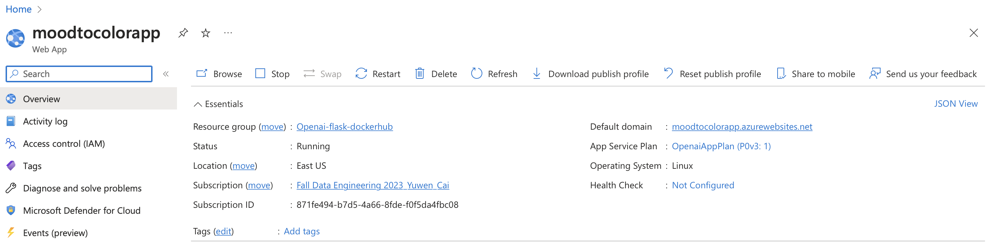
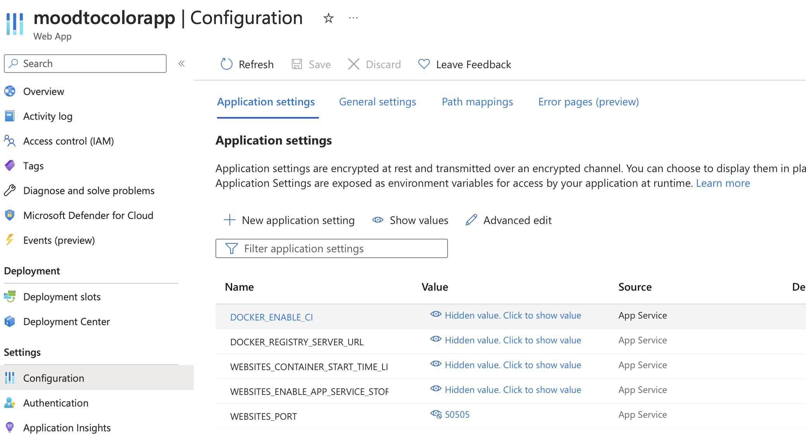

# IDS 706 Data Engineering Individual Project 4

Yuwen Cai 

## Website & Video explanation
[Mood Color Generator](https://colorfulmood.azurewebsites.net)

[Youtuve Link](https://youtu.be/KH3d2TauRNk)

## Purpose of the project

The purpose of this individual project is to build a web application using Flask. We call the API for a Large Language Model (LLM) within the web app to implement our functionality.

## Overview

This project allows input of a piece of text describing the mood and generates a web page in that color with color description.

## Flask

A flask app is developed to handle requests from the user. The app is in `main.py`.

There are two routings in the app: 

1. `/`

    The homepage is routed to the `index()` function, which returns the `index.html` with a text box for users to write their mood.

2. `/get-color`
    
    The result page displays the color suggestion and description.

## LLM Integration

In this project, the API of OpenAI is integrated with the app. A token was generated for the app to use.

## Containerization

To make the project easy to deploy, it is containerized with docker.

First, log in to Docker Hub in the terminal using the following command.

`docker login --username <username>`

Then the files in the project directory are packed into a docker image using the following command:

`docker docker build -t <username>/<repo name> .`

Then the image is pushed to Docker Hub using the following command:

`docker push <username>/<repo name>`

It can be verified that the image is successfully uploaded by checking the repository.

Here is what this project's repository looks like after the push.

## Deployment

The website is then deployed to Azure. Add the LLM API key, and the website port `WEBSITES_PORT` to the configuration.

Here is a screenshot of the Azure page.

Configuration settings:

## Reference
https://github.com/DerekLW6/Azure-Flask-App

